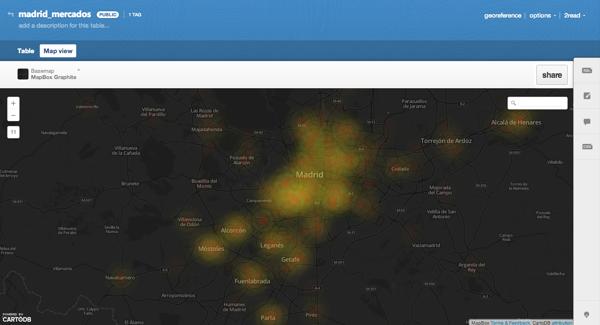
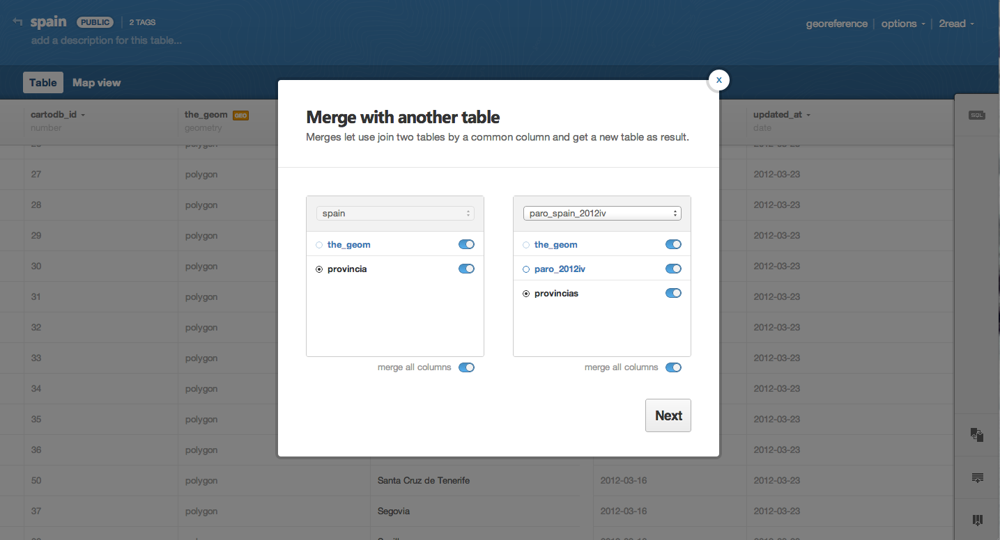
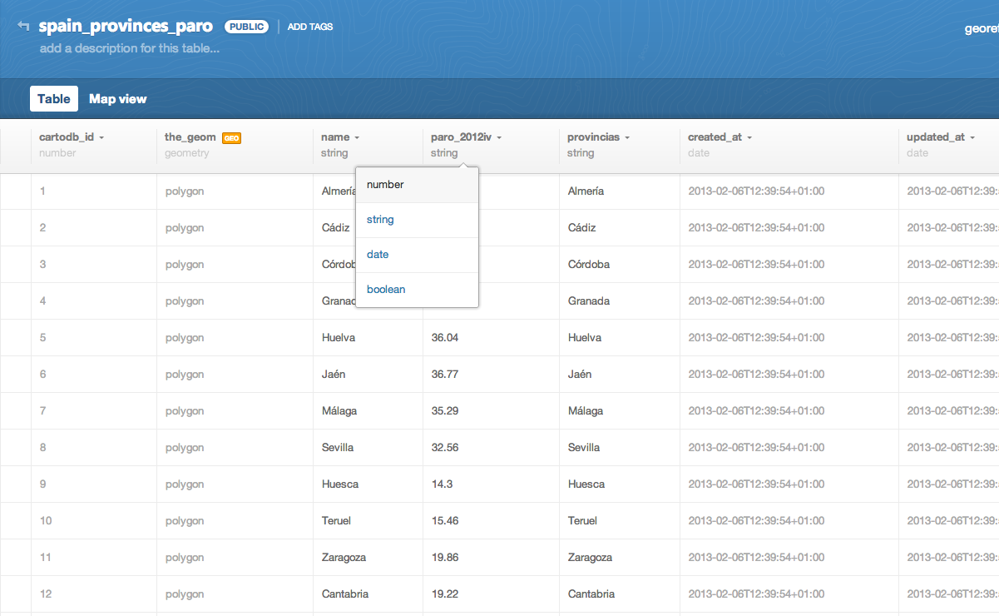
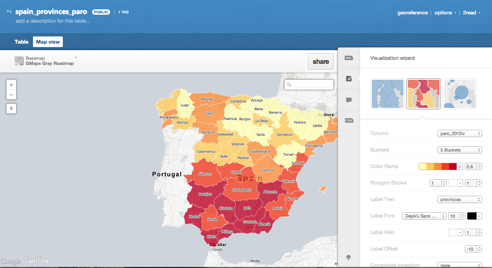
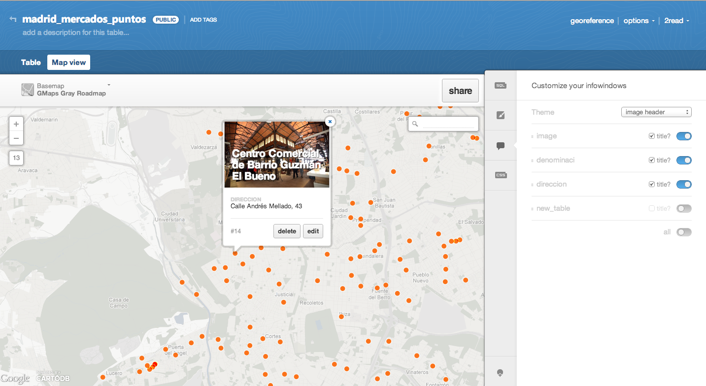
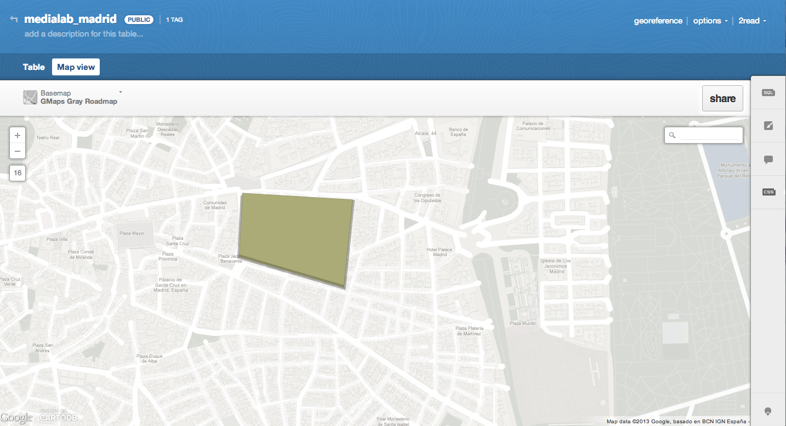

<h1>Workshop - Grupo de Periodismo de Datos del Medialab Prado<h1>
<h2>Enlaces y recursos adicionales</h2>

Los archivos incluidos en este repositorio (index.html, CSS) contienen todos los elementos necesarios para publicar un mapa elaborado con CartoDB en una plantilla de información. La plantilla ha sido elaborada por [@saleiva](https://github.com/CartoDB/cartodb-publishing-templates). 

Plantillas de CartDB:

[https://github.com/CartoDB/cartodb-publishing-templates](https://github.com/CartoDB/cartodb-publishing-templates)

<h3>Workshop</h3>

El primer ejercicio consiste en importar datos a CartoDB y combinarlos en una única tabla para la elaboración de un mapa del paro en España.

Los Datos de las provincias españolas están disponibles en:
 

[http://2read.cartodb.com/tables/spain_provinces/public/](http://2read.cartodb.com/tables/spain_provinces/public/)

Datos del paro (4º trimestre de 2012):
 [http://2read.cartodb.com/tables/paro_spain_2012iv/public/](http://2read.cartodb.com/tables/paro_spain_2012iv/public/)

Para unir las dos tablas, utilizamos la función "merge tables" del panel de CartoDB. Elegimos la tabla que queremos combinar y seleccionamos la columna que utilizaremos como referencia ("provincia" y "provincias") más las que queremos importar. Asignamos un nombre a la nueva tabla.  

<h3>Elaboración del mapa del paro</h3>

Los datos están en la columna "paro_2012iv". Transformamos la columna de "string" a "numbers" (para poder utilizarla como referencia para elaborar el mapa).

En la vista de "map view", elegimos el mapa de base y editamos el estilo del mapa a través del menú "visualization wizard". 

El mapa se puede publicar a través de la función "share". 

<h3>Edición avanzada</h3>

Utilizamos la tabla siguiente:
 

[http://2read.cartodb.com/tables/madrid_mercados_puntos/public/](http://2read.cartodb.com/tables/madrid_mercados_puntos/public/)

Query utilizada para unir las tres tablas originales:
 

<code>SELECT 'abastos' as new_table, the_geom, denominaci, direccion FROM abastos UNION SELECT 'galerias' as new_table, the_geom, direccion, nombre from galimenta UNION select 'hipermercados' as new_table, the_geom, direccion, eti FROM hipermercados</code>

Añade una imagen al infowindow

Edita los estilos (diferenciar puntos)

Crear un polígono, puntos o líneas + cartocss building-height

Importa datos de CartoCSS

