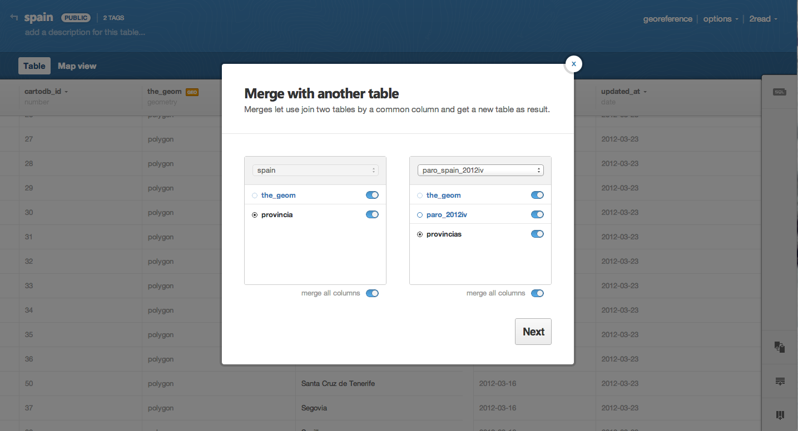
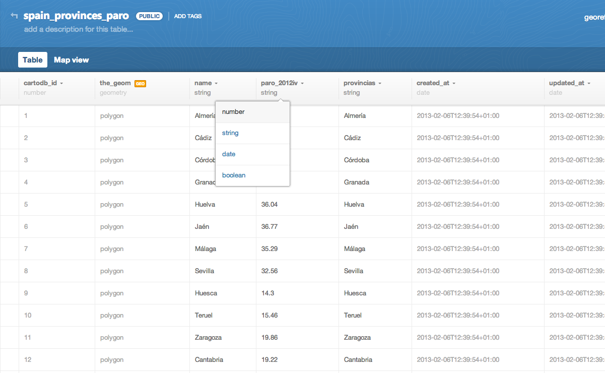
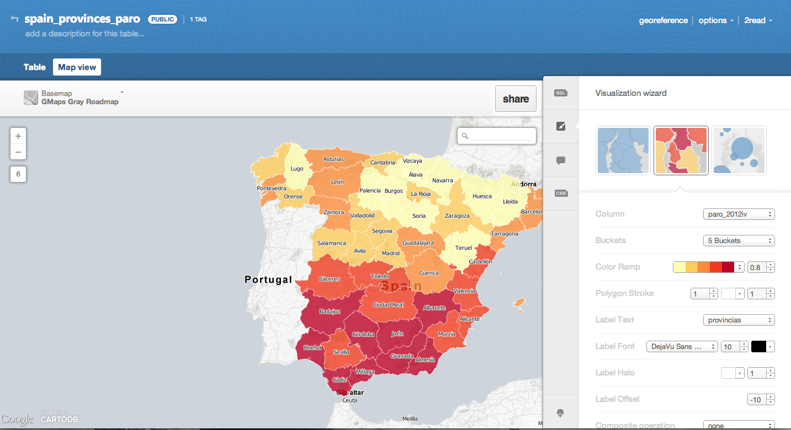
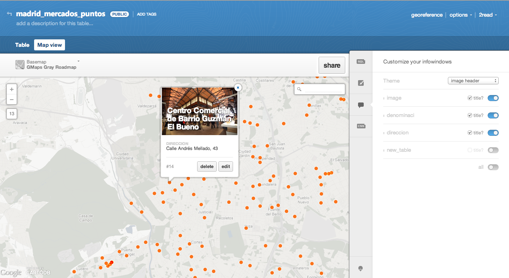
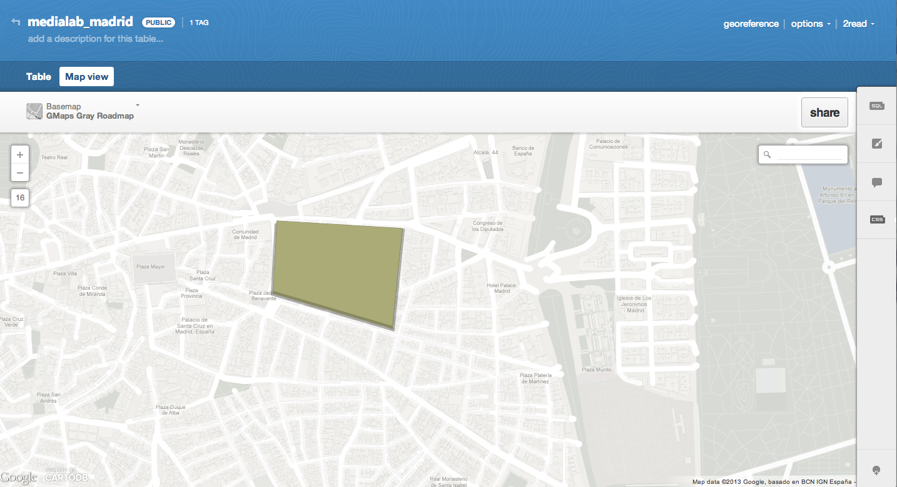
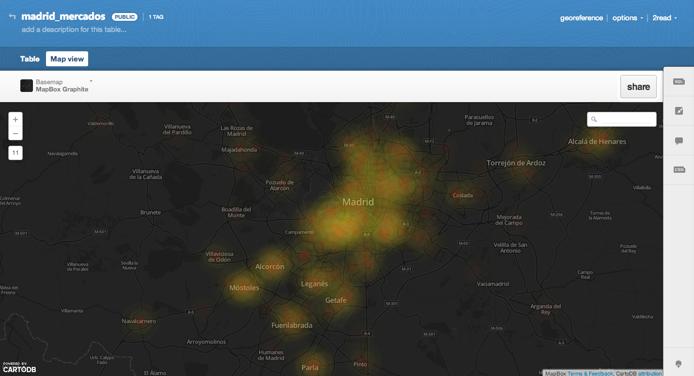

<h2>Making maps with CartoDB<h2> 
<h3>- Outline for a Workshop & mapping class-</h3>

Links and resources collected for the workshop on mapmaking with CartoDB as a tool for journalism, held at the <a href="http://medialab-prado.es/article/periodismo_datos_mapas_interactivos">MediaLab Prado Data Journalism group</a> (feb. 2013), and the mapping class from the '13 IE Business School Master on Digital Journalism. 

Full download includes all data files and a responsive <a href="http://developers.cartodb.com/documentation/cartodb-js.html">CartoDBjs</a> template made by <a href="https://twitter.com/saleiva">@saleiva</a>. 

More CartoDB templates: https://github.com/CartoDB/cartodb-publishing-templates

<strong>Note:</strong> CartoDB 2.1 adds multilayer support and some new features not included in this tutorial. Check this <a href="http://blog.cartodb.com/post/55209377679/we-have-released-cartodb-2-1-enjoy-multilayer-maps-and">link</a> for a full description of the new features

<h3>Workshop</h3>

The workshop is planned as an introduction to data journalism with maps. First, it is shown how to upload and combine data into CartoDB to elaborate a map of unemployment in Spain. 

- Spanish provinces data: 
 

Spanish-provinces-shp.zip (data folder)/

- Unemployment data (Q4 2012, <a hhref="http://ine.es/">INE</a>):
 

Unemployment-spain.csv (data folder)

First file has all geographic information needed. It is a compressed shapefile. Drag and drop the .zip file data into CartoDB to upload the data. The unemployment data is a .csv file. Drag & drop it too.

We need to merge both files (shapefile + data) to build a <a href="http://www.ncgia.ucsb.edu/cctp/units/unit47/html/mas_form.html">choropleth map</a>. Here there is a full tutorial on using the merge tables function available at CartoDB: <a href="http://developers.cartodb.com/tutorials/merging_data.html">http://developers.cartodb.com/tutorials/merging_data.html</a>.

More info:

- [CartoDB tour](http://cartodb.com/tour)
- [Getting started with CartoDB](http://developers.cartodb.com/documentation/using-cartodb.html)
- [CartoCSS reference](http://mapbox.com/carto/api/2.1.0/)
- [Join two tables using SQL](http://developers.cartodb.com/tutorials/joining_data.html)

<h3>Editing</h3>

The unemployment rate is in a column called "paro_2012iv". We need to transform it from "string" to "number" to be able to use it for encoding numeric information.

Click on "map view", choose any base map and make a choropleth map throug the "visualization wizard" menu. 

The map is ready. Using the "share" menu, share or embedded the final map.

<h3>Advanced styling</h3>

We'll use a zip file named "markets.zip" (data folder). Drag and drop it into your CartoDB dashboard.
 

It includes data (shapefile) from three files on markets in Madrid. I ran the the following SQL query to join them: 
 
<code>SELECT 'abastos' as new_table, the_geom, denominaci, direccion FROM abastos UNION SELECT 'galerias' as new_table, the_geom, direccion, nombre from galimenta UNION SELECT 'hipermercados' as new_table, the_geom, direccion, eti FROM hipermercados</code>

<h4>Add an image to the infowindow</h4>

Create a new column and paste the url where the image is hosted. In the "infowindown" menu (map view), choose a style for the header and drag the url column to the first position. 

<h4>Editing CartoCSS</h4>

We need to edit manually the style of the map to be able to create a color code for each type of market: "abastos", "galerías", "hipermercados".

CartoCSS Code: https://gist.github.com/cmdelaserna/1b44e2be33b176422d20

Map: http://cdb.io/Wza1lw

<h4>Create a 3D Polygon</h4>

You can create a polygon, a point or a line clicking on the "add feature" function (map view). To specify the height of a polygon and create some-kind of a 3D building, click on the table view, add a "height" column, and specify the value. Then, add just a line to the CartoCSS code: 

<code>building-height:[height]</code>

<h4>Create an intensity map</h4>

CartoCSS to create an intensity map out the data on markets in Madrid: 

CartoCSS: https://gist.github.com/cmdelaserna/4726629

Map: http://cdb.io/VGx3Ko

<h4>Import OpenStreetMap data</h4>

http://www.slideshare.net/andrewxhill/using-cartodb-to-analyze-openstreetmap-data

