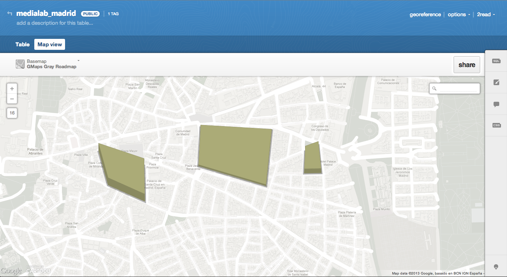

<h1>Workshop - Elaboración de mapas con CartoDB<h1> 

Enlaces e información complementaria recopilados con motivo del taller sobre elaboración de mapas interactivos organizado por el grupo de Periodismo de Datos de MediaLab Prado (feb. 2013, http://medialab-prado.es/article/periodismo_datos_mapas_interactivos).

Los archivos incluidos (index.html, CSS) contienen todos los elementos necesarios para publicar un mapa elaborado con CartoDB en una plantilla de información para PC, iPad y móvil (elaborada por @saleiva, https://twitter.com/saleiva). 

Más plantillas de CartoDB: https://github.com/CartoDB/cartodb-publishing-templates

<h3>Workshop</h3>

El primer ejercicio del taller es una introducción al periodismo de datos con mapas. Se muestra cómo recopilar datos, importarlos a CartoDB y combinarlos varias tablas para la elaboración de un mapa dinámico del paro en España.

- Los datos de las provincias españolas están disponibles en:
 

http://2read.cartodb.com/tables/spain_provinces/public/

- Datos del paro (4º trimestre de 2012):
 

http://2read.cartodb.com/tables/paro_spain_2012iv/public/

La primera tabla contiene la información geográfica sobre las provincias de España en un archivo shapefile comprimido. Para importarla, sólo es necesario arrastrar el archivo .zip (sin descomprimir) al panel de usuario de CartoDB. El archivo con los datos del paro se importa de la misma forma. 

Para unir las dos tablas, y poder elaborar un mapa de [cloropetas](http://www.ncgia.ucsb.edu/cctp/units/unit47/html/mas_form.html) con los datos del paro, utilizamos la función **"merge tables"**. Desde la tabla con la información geográfica, elegimos la tabla y la información que queremos combinar y seleccionamos la columna que utilizaremos como referencia (en este caso, "provincia" y "provincias"). Asignamos un nombre a la nueva tabla.
  

Enlaces relacionados:

- [CartoDB tour](http://cartodb.com/tour)
- [Getting started with CartoDB](http://developers.cartodb.com/documentation/using-cartodb.html)
- [CartoCSS reference](http://mapbox.com/carto/api/2.1.0/)

<h3>Edición</h3>

Los datos que queremos representar están en la columna "paro_2012iv". Con frecuencia, como ocurre en este caso, es necesario transformar la columna de "string" a "numbers" para poder utilizarla como referencia.

En la vista de "map view", elegimos el mapa de base y editamos el estilo a través del menú "visualization wizard". La segunda opción calcula los intervalos y permite elaborar de forma automática un mapa de cloropetas. 

El mapa se puede publicar a través de la función **"share"**. 

<h3>Edición avanzada</h3>

Utilizamos la tabla siguiente:
 

http://2read.cartodb.com/tables/madrid_mercados_puntos/public/

La tabla incluye los datos de tres archivos. Los he unido utilizando esta función en el **menú SQL**: 
 
<code>SELECT 'abastos' as new_table, the_geom, denominaci, direccion FROM abastos UNION SELECT 'galerias' as new_table, the_geom, direccion, nombre from galimenta UNION SELECT 'hipermercados' as new_table, the_geom, direccion, eti FROM hipermercados</code>

Añadir una **imagen** al infowindow

Editamos los estilos (diferenciar puntos)

Código CartoCSS: https://gist.github.com/cmdelaserna/1b44e2be33b176422d20

Mapa: http://cdb.io/Wza1lw

Crear un polígono, puntos o líneas + cartocss **building-height**

Importa datos de OpenStreetMap

http://www.slideshare.net/andrewxhill/using-cartodb-to-analyze-openstreetmap-data

